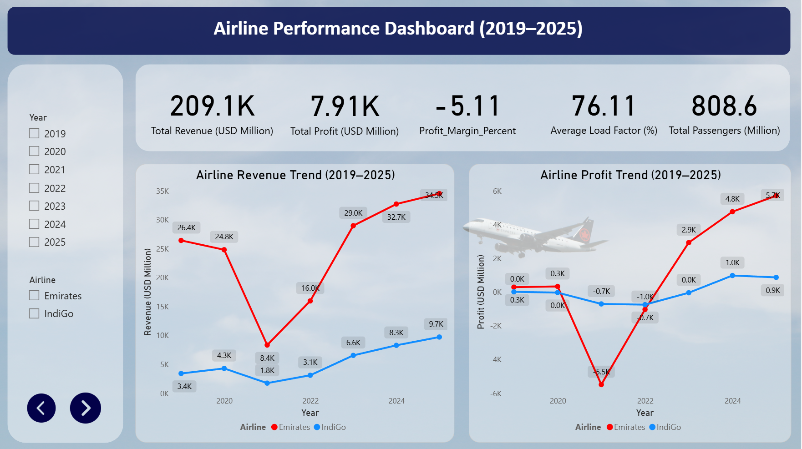
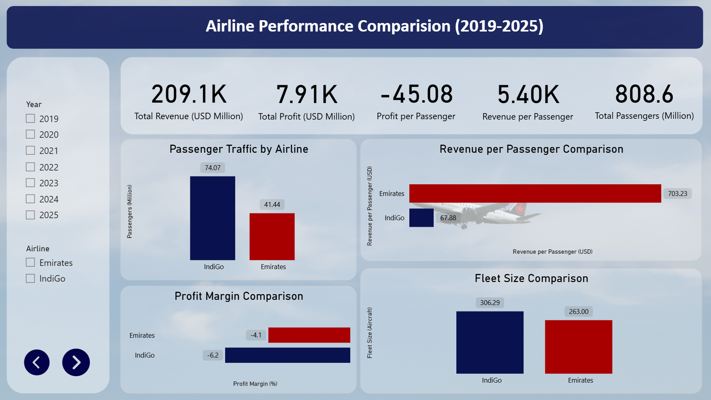
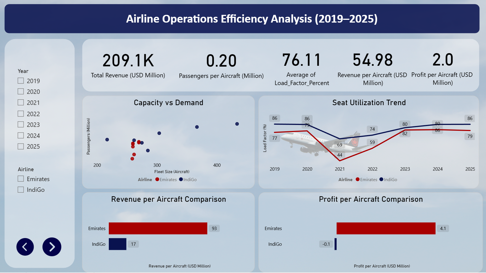

# Airline Industry Analysis (2019–2025)

This project analyzes the financial and operational performance of Emirates and IndiGo using airline data from 2019–2025.

## Interactive Power BI Dashboard

https://app.powerbi.com/view?r=eyJrIjoiYmUzMmU0YjktMDA0Ny00NTU5LWJhYzUtODkzYjRlNjYyZDk3IiwidCI6ImQ0MzBkNGE4LThhNDctNDI2OC1iMjk2LTUxMDRlNmY2MmUwZSJ9

## Dashboard Preview

### Industry Overview

### Airline Comparison

### Operational Efficiency

## Tools Used
- Microsoft Excel
- Power BI

## Project Structure
- Dataset → Excel dataset
- Dashboard → Power BI dashboard
- Report → Research report
- Dashboard_Screenshots → Dashboard images
